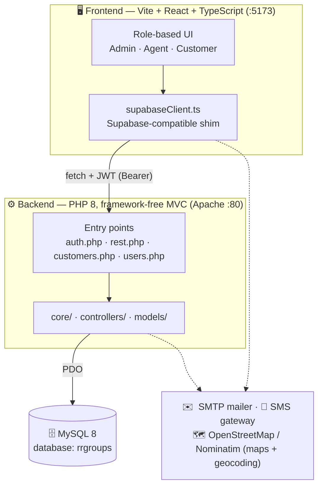
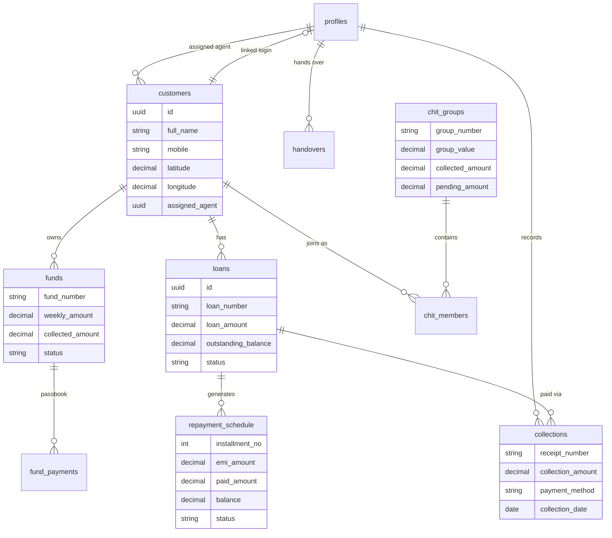
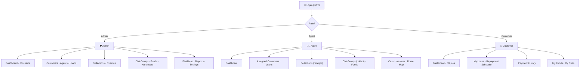
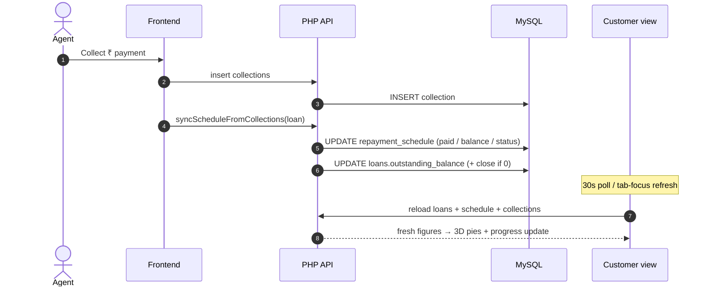
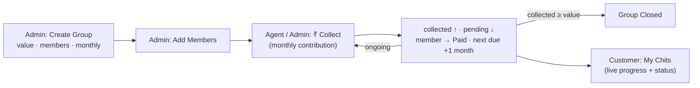

<div align="center">

# RR Groups — Loan & Collection Suite

**A self-hosted platform for lenders in India — loans, repayments, chit funds, and field collections in one place.**

Gold-on-navy fintech UI · React + TypeScript frontend · dependency-free PHP + MySQL backend · JWT auth

</div>

---

## Overview

RR Groups (FinCollect) is a full-stack lending & collection management app. It manages the
whole journey — customer onboarding, loan origination, EMI/repayment schedules, field
collections with digital receipts, chit-fund groups, overdue tracking, and reporting —
across three roles: **Admin**, **Agent**, and **Customer**.



The backend is a small, framework-free PHP API served by XAMPP's Apache, talking to a
standalone **MySQL 8** server. The frontend calls it through a Supabase-compatible client
shim, so screens use a familiar `supabase.from('table')…` API with zero direct URL wiring.
Every list view is **real-time** — 30-second polling plus an instant refresh whenever the
tab regains focus — so a payment recorded by an agent shows up on the admin and customer
screens within seconds.

---

## Features

| Area | What it does |
|------|--------------|
| **Roles** | Admin (full control), Agent (field collections & assigned customers), Customer (self-service portal) — each with a scoped navigation and dashboard. |
| **Customers** | KYC onboarding (Aadhaar, PAN, occupation, photo), agent assignment, optional linked login. Export to PDF / Excel / CSV. |
| **Loans** | Monthly / weekly / daily plans with automatic EMI, interest & processing-fee calculation. |
| **Repayment schedules** | Auto-generated installment plans with real-time paid / partial / overdue status. |
| **Collections** | Field receipts with company letterhead, photo proof and borrower signature; agent-scoped views. Each payment **auto-updates the repayment schedule** and the loan's outstanding balance. |
| **Funds (recurring savings)** | Weekly deposit funds with a **passbook** (per-payment ledger), maturity + bonus math, due-date tracking, and **early full settlement**. |
| **Chit funds** | End-to-end chit groups — members, monthly contributions, live collection progress, agent **collect** action, and a customer **My Chits** view. |
| **Cash handover** | Agents reconcile daily cash vs UPI; any shortfall carries forward as **pending** to the next day. |
| **Field & Route maps** | Real **Leaflet + OpenStreetMap** maps — admin **Field Map** (who collected where) and agent **Route Map** (turn-by-turn navigation). Addresses **auto-geocode** to lat/lng as you type. |
| **Overdue** | Tracking and recovery of overdue accounts. |
| **Reports & analytics** | Daily / monthly / agent-performance reports, dependency-free **3D pie / trend charts**, real PDF & Excel export. |
| **Notifications** | Per-user notifications with a live unread badge; admins can broadcast to customers. |
| **Profile** | Self-service profile editing (contact, KYC, avatar) + secure email/password change. |
| **Auth** | JWT login, bcrypt passwords, and a 2-step **OTP password reset** (email + SMS, with demo fallback). |
| **Settings** | Company branding (name, logo, address, GST), interest config, SMS/WhatsApp toggles — reflected app-wide (incl. receipts) in real time. |

---

## Tech stack

**Frontend**
- Vite · React 18 · TypeScript
- Tailwind CSS (custom gold/navy theme — see [`frontend/tailwind.config.js`](frontend/tailwind.config.js))
- Plus Jakarta Sans · lucide-react icons
- jsPDF + jspdf-autotable (PDF export), HTML-table Excel export

**Backend**
- PHP 8 (no framework, no Composer) — lightweight MVC
- MySQL 8 via PDO
- JWT (HS256) auth · bcrypt password hashing
- Dependency-free SMTP mailer + SMS gateway (Fast2SMS / MSG91) for OTP delivery

---

## Project structure

```
RRGroups/
├── backend/                  PHP API (Apache :80)  — see backend/README.md
│   ├── auth.php              login / me / update_profile / request_otp / reset_password
│   ├── rest.php             generic PostgREST-lite CRUD for whitelisted tables
│   ├── users.php            admin-only user management
│   ├── customers.php        customer create/update (+ optional linked login)
│   ├── core/                Database, Jwt, Model, QueryParser, Controller, Mailer, Sms
│   ├── controllers/         AuthController, ResourceController, UserController,
│   │                        CustomerController, FundController, FundPaymentController,
│   │                        HandoverController
│   ├── models/              Profile, Customer, Loan, Collection, ChitGroup, ChitMember,
│   │                        Fund, FundPayment, Handover, …
│   ├── schema.sql           database + tables + seed accounts
│   ├── migrate.php          idempotent migrations
│   ├── backfill_*.php       one-time reconcilers (schedule paid, fund passbook)
│   └── seed.php             demo passwords + sample data
│
└── frontend/                Vite + React app (:5173)
    ├── src/
    │   ├── App.tsx          routing shell (role-based)
    │   ├── auth.tsx         AuthProvider (JWT session, profile, refresh)
    │   ├── company.tsx      CompanyProvider (live company name/logo/address/GST)
    │   ├── supabaseClient.ts Supabase-compatible shim over the PHP API
    │   ├── schedule.ts      waterfall sync: collections → repayment_schedule + loan
    │   ├── geocode.ts       address → lat/lng via Nominatim (OpenStreetMap)
    │   ├── calc.ts          EMI / interest / daily-plan math, date & currency format
    │   ├── hooks.ts         useNotifications (live badge), useAgents
    │   ├── screens/         one file per page (dashboards, customers, loans, funds,
    │   │                    chits, handovers, field-map, route-map, …)
    │   └── components/      Layout, ui, charts (3D pie / trend), RouteMap (Leaflet)
    └── tailwind.config.js   brand (gold) + ink (navy) palette
```

---

## Architecture & data flows

### Database (entity relationships)



### Role-based navigation



### Real-time collection → schedule sync

When an agent or admin records a payment, the app rebuilds the loan's schedule and
outstanding balance from the **actual collections** (an idempotent earliest-first
waterfall), so the customer's screens reflect it within seconds.



### Chit-fund lifecycle



---

## Getting started

### Prerequisites
- **XAMPP** (Apache + PHP 8) — the project lives at `htdocs/RRGroups`
- **MySQL 8** running as its own service (the one MySQL Workbench connects to)
- **Node.js 18+**

### 1. Create the database
Open **MySQL Workbench** → connect as `root` → **File ▸ Open SQL Script…** →
[`backend/schema.sql`](backend/schema.sql) → **⚡ Execute**.

This creates the `rrgroups` database, all tables, and a limited app user `rrgroups_app`.

> CLI alternative:
> `"C:\Program Files\MySQL\MySQL Server 8.0\bin\mysql.exe" -u root -p < backend/schema.sql`

### 2. Seed demo passwords & sample data
```bash
cd backend
"D:\xampp\php\php.exe" seed.php
```

### 3. Apply migrations (existing databases only)
```bash
"D:\xampp\php\php.exe" migrate.php
```

### 4. Start Apache
Start **Apache** in the XAMPP Control Panel — it serves the API at
`http://localhost/RRGroups/backend`. (MySQL 8 is its own Windows service; you do **not**
need XAMPP's bundled MySQL.)

### 5. Run the frontend
```bash
cd frontend
npm install
npm run dev
```
Open **http://localhost:5173**.

---

## Demo accounts

| Email | Password | Role |
|-------|----------|------|
| `owner@fincollect.in` | `owner123` | Admin |
| `admin@fincollect.in` | `admin123` | Admin |
| `agent@fincollect.in` | `agent123` | Agent |
| `customer@fincollect.in` | `customer123` | Customer |

The login screen also has **Quick Demo Login** buttons.

---

## Frontend scripts

```bash
npm run dev        # start the Vite dev server (:5173)
npm run build      # production build → dist/
npm run preview    # preview the production build
npm run typecheck  # tsc --noEmit
npm run lint       # eslint
```

---

## Configuration

All backend config lives in [`backend/config.php`](backend/config.php):

- **Database** — host, name, user, password (keep in sync with `schema.sql`).
- **`jwt_secret`** — change to a long random string outside local dev.
- **`cors_origins`** — allowed frontend origins (defaults to `localhost:5173`).
- **`smtp`** — Gmail/SMTP credentials for OTP email delivery (leave blank → demo OTP).
- **`sms`** — Fast2SMS / MSG91 gateway for OTP SMS delivery (leave blank → demo OTP).

> ⚠️ `config.php` holds secrets (DB password, JWT secret, SMTP/SMS keys). Don't commit it to a public repo.

### OTP delivery (password reset)
The 2-step reset (**email + registered mobile → OTP → new password**) delivers the code
over any configured channel. With no provider configured, the OTP is shown on-screen in
**demo mode**. To enable real delivery, fill the `smtp` and/or `sms` blocks in `config.php`
— no code changes needed.

---

## API quick reference

```
POST  /backend/auth.php?action=login            { email, password } → { token, user, profile }
GET   /backend/auth.php?action=me               (Bearer token)      → { user, profile }
POST  /backend/auth.php?action=update_profile   (Bearer) self-service profile update
POST  /backend/auth.php?action=request_otp      { email, mobile }   → sends OTP
POST  /backend/auth.php?action=reset_password   { email, mobile, otp, new_password }

GET   /backend/rest.php?table=loans&status=eq.active&order=created_at.desc&limit=10
POST  /backend/rest.php?table=loans             body: object | array
PATCH /backend/rest.php?table=loans&id=eq.<uuid>
DELETE/backend/rest.php?table=loans&id=eq.<uuid>
```

Filters use `column=<op>.<value>` where `op ∈ eq, neq, gt, gte, lt, lte, like, in, is`.
All `rest.php` requests require a valid `Authorization: Bearer <jwt>` header.

See [`backend/README.md`](backend/README.md) for the full backend/MVC reference.

---

## Development journey

A summary of everything built so far, grouped by milestone (most foundational first).

### 1 · Backend migration & foundation
- Replaced the original **Supabase** backend with a **self-hosted PHP + MySQL** API — the
  frontend was kept unchanged via a **Supabase-compatible client shim**
  (`supabase.from('table')…` over PostgREST-lite query params), so no screen URLs changed.
- Designed the **MySQL 8 schema** (now 13 tables: profiles, customers, loans,
  repayment_schedule, collections, chit_groups, chit_members, funds, fund_payments,
  handovers, notifications, settings, push_subscriptions) plus a limited `rrgroups_app`
  user so the app never runs as `root`.
- **JWT (HS256)** authentication with **bcrypt** password hashing.
- Refactored the backend into a clean, framework-free **MVC** (`core/`, `models/`,
  `controllers/` + thin entry-point scripts).

### 2 · Roles & core navigation
- Established the **three-role system** — Admin / Agent / Customer (Owner = Admin) — with
  role-scoped navigation and dashboards; customer logins are **linked to their customer record**.
- Removed the "Select your workspace" role-selection screen.
- Built the **landing page** and refreshed the **login** (email-only, quick demo accounts).

### 3 · Customers, Agents & Loans
- **Customers:** KYC onboarding (Aadhaar, PAN, occupation, photo), agent assignment,
  optional linked login, and **PDF / CSV / Excel export**. Fixed the "Unassigned" agent
  race condition and the Add-Customer insert; added login-credential fields.
- **Agents (User Management):** agent-scoped stat cards, KYC-style Add-Agent form with
  login credentials, and an Agent-only role field.
- Added per-entity controllers (`CustomerController`, `UserController`) with server-side
  customer-code generation and validation.

### 4 · Settings, Reports & Notifications
- **Settings:** fixed "Failed to save" (global ISO→MySQL **datetime normalization**),
  made the **company logo/name update live across the app**, and connected SMS/WhatsApp
  preferences to the backend.
- **Reports & Analytics:** fixed an IST timezone bug in the date range and added **real
  PDF & Excel export** (shared with Customers).
- **Notifications:** scoped per user, added **admin → customer broadcast**, and a
  **live unread badge** (20s polling + tab-focus refresh + refresh after every action).

### 5 · Account & profile
- Added a **header profile dropdown** (My Profile / Notifications / Settings / Sign out).
- Built the **My Profile** page — self-service editing of contact, KYC and avatar, plus a
  **secure email/password change** (verified with the current password) through a new
  self-service `update_profile` endpoint that can never change a user's own role/status.

### 6 · Mobile experience & polish
- Restructured the **mobile header** — menu + brand logo on the left; search, notifications
  and profile on the right; with a collapsible search bar.
- Made the **dashboard stat cards responsive** (no more truncated ₹ amounts).
- Redesigned the **bottom navigation** — 4 role-based tabs + a **More** button that opens
  the full drawer, with an active pill and a notification dot.
- Added a **branded logo loading screen** and stopped the push-notification prompt from
  auto-firing on load (Chrome was blocking it).

### 7 · Landing & login refresh
- Removed the Features/Roles/Security nav links; refreshed the hero copy, added
  **colored feature tiles**, a dot-grid background, and gradient stats.
- Aligned the **login page** branding with the landing page and removed inaccurate
  compliance claims.

### 8 · Password reset (OTP)
- Built a real **2-step OTP reset**: verify **email + registered mobile → OTP → new password**.
- Backend `request_otp` / `reset_password` endpoints with a **hashed, 5-minute, single-use
  OTP** (new `reset_otp_*` columns added via migration).
- Added a **dependency-free SMTP mailer** and an **SMS gateway** (Fast2SMS / MSG91) for
  real delivery, with an on-screen **demo-mode** fallback when no provider is configured.

### 9 · Documentation & brand
- Produced an interactive **color-palette** reference and this README.

### 10 · Funds (recurring savings) & passbook
- Built **weekly deposit funds** with a per-payment **passbook** ledger (`funds` +
  `fund_payments` tables), remaining-week due dates, maturity + **bonus** math, and
  **early full settlement**. Added `backfill_fund_payments.php` to reconstruct passbook
  entries for funds collected before the ledger existed.

### 11 · Real-time collections & repayment schedule
- Every collection now runs `syncScheduleFromCollections()` — an **idempotent, earliest-first
  waterfall** that recomputes each installment's paid / balance / status **and** the loan's
  `outstanding_balance` (auto-closing when cleared). Added `backfill_schedule_paid.php` for
  historical payments.
- Made customer **Dashboard, Repayment Schedule and Payment History** live (30s polling +
  tab-focus refresh + manual refresh).

### 12 · Field operations — cash handover & maps
- **Cash handover:** agents reconcile daily **cash vs UPI**; shortfalls carry forward as
  **pending** (`handovers` table).
- **Maps:** real **Leaflet + OpenStreetMap** — admin **Field Map** (who collected where, with
  agent filter) and agent **Route Map** (navigation, call, GPS). Customer locations
  **auto-geocode** from a typed address via Nominatim (`customers.latitude/longitude`), with
  marker de-overlap for shared coordinates.

### 13 · Analytics, chit reach & mobile polish
- Added dependency-free **3D pie charts** and responsive trend charts; fixed the broken
  100%-single-slice donut and mobile chart alignment.
- Extended **chit funds** end-to-end: a per-member **Collect** action (updates progress,
  status and next due), agent access to Chit Groups, and a customer **My Chits** view.
- Company **receipts** gained a branding letterhead (name, logo, address, GST) and
  print-alignment fixes.

---

## Design

The UI uses a **gold-on-navy** identity tuned to the RR Groups crest:

| Role | Hex | Token |
|------|-----|-------|
| Brand · primary | `#a87615` | `brand-600` |
| Brand · accent | `#dcaa3c` | `brand-400` |
| Ink · text | `#0d1226` | `ink-900` |
| Ink · muted | `#5f6890` | `ink-500` |
| Ground | `#f7f8fb` | `ink-50` |

Semantic colors: 🟢 emerald (paid) · 🔴 rose (overdue) · 🟡 amber (partial) · 🟣 violet & 🔵 cyan (features).

---

<div align="center">
<sub>Designed &amp; developed by <a href="https://www.cloudhawk.in">CloudHawk</a></sub>
</div>
